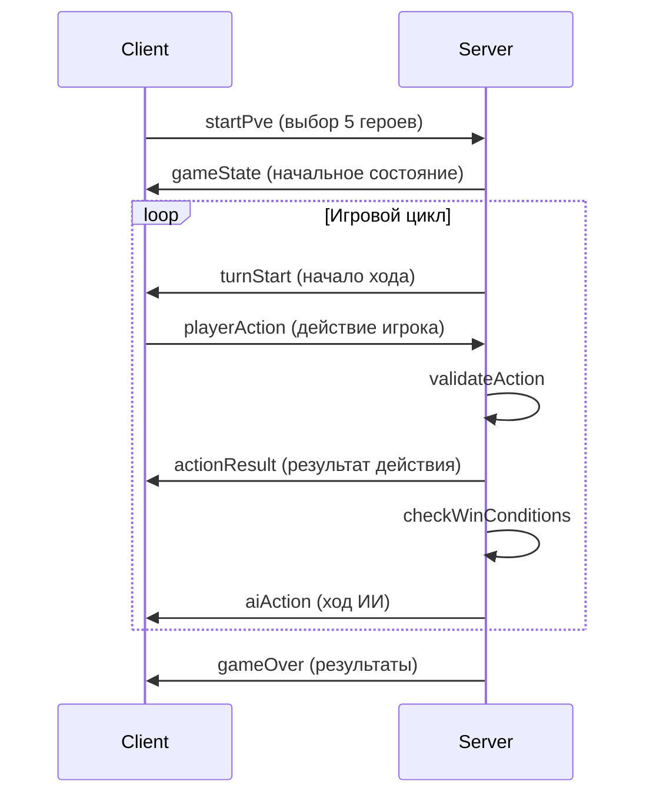

```mermaid
sequenceDiagram
    participant Client
    participant Server
    Client->>Server: startPve (выбор 5 героев)
    Server->>Client: gameState (начальное состояние)
    loop Игровой цикл
        Server->>Client: turnStart (начало хода)
        Client->>Server: playerAction (действие игрока)
        Server->>Server: validateAction
        Server->>Client: actionResult (результат действия)
        Server->>Server: checkWinConditions
        Server->>Client: aiAction (ход ИИ)
    end
    Server->>Client: gameOver (результаты)
```